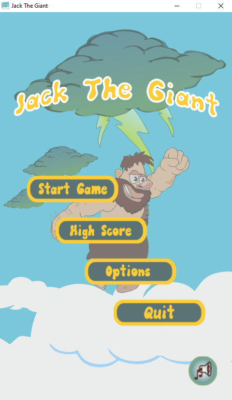
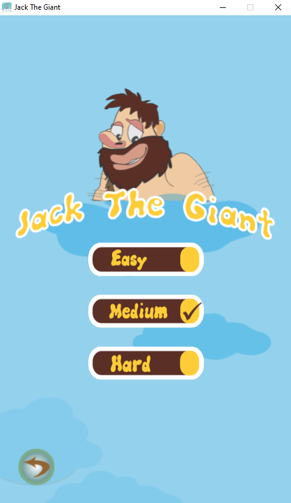
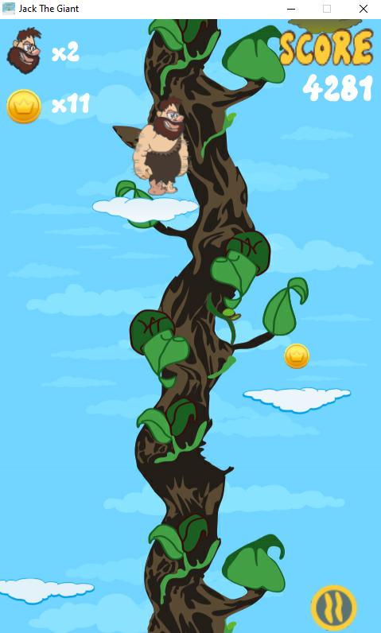
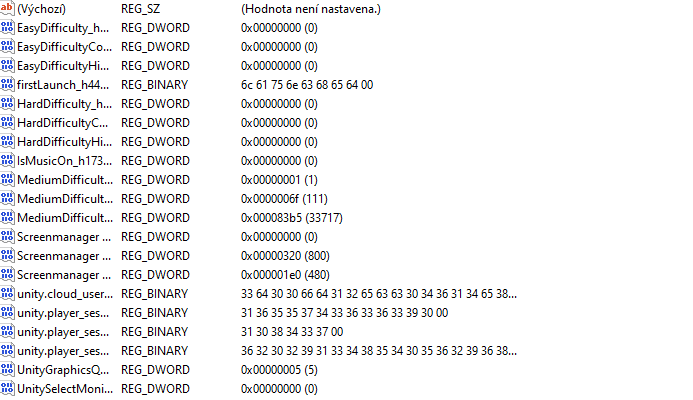

# Jack-The-Giant
2D Game made by following Udemy course

This is my first created Game with Unity and C#

# Main Menu
As any other game, it is necessary to have Main Menu so player can choose
the game difficulty, set music On and Off

 

# Main Goal
In this 2D platformer game the main goal is to get highest possible score by:
 - moving between white clouds
 - collecting coins and extra lives
 - avoiding dark clouds
 - avoiding reaching top or bottom bounds

# Game Settings
The Game is built in fixed 480x800 resolution.
There is no save file.
High scores for different difficulties are saved
in player prefferences in the Registry

